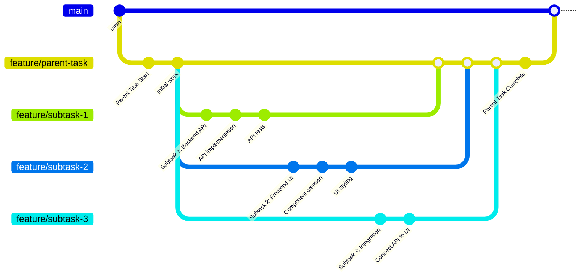

子任务允许你将复杂任务拆分为更小、更易管理的部分。每个子任务都关联到特定的任务尝试，并继承相同的项目和分支上下文。

## 创建子任务

<Frame>

</Frame>

要从现有任务尝试创建子任务：

<Steps>
<Step title="导航到任务尝试">
  打开你想要创建子任务的任务。
</Step>

<Step title="点击 Create Subtask">
  点击任务右上角的三点图标，然后选择 **Create Subtask**。
</Step>

<Step title="填写子任务详情">
  任务创建对话框会打开，父任务尝试和基础分支会自动设置。添加你的子任务标题和描述。
</Step>

<Step title="保存子任务">
  点击 **Save** 创建子任务。它将作为新任务出现在你的看板上。
</Step>
</Steps>

<Note>
创建子任务时，它会自动继承父任务尝试的基础分支，确保开发工作流的一致性。
</Note>

## 查看带有子任务的任务

<Frame>

</Frame>

查看父任务时，你可以在 **Task Relationships** 面板中看到其子任务。这个可折叠的部分显示：

- **Child Tasks** 及其数量（如"CHILD TASKS (1)"）
- 各个子任务的标题及查看链接
- 在父任务和子任务之间方便的导航

这有助于你跟踪所有相关工作项的进度，并一目了然地了解任务层级结构。

## 查看子任务详情

<Frame>

</Frame>

查看子任务时，**Task Relationships** 面板显示：

- **Parent Task** 部分显示父任务标题
- 导航到父任务的直接链接
- 明确的视觉标识表明这是一个子任务
- 关于父子关系的上下文信息

子任务也有自己的 **Create Subtask** 按钮，允许你在需要时创建嵌套的子任务。

## 子任务的工作原理

Vibe Kanban 中的子任务遵循以下关键原则：

### Git 分支工作流

子任务创建自己的功能分支，可以独立工作，同时保持与父任务的连接：

### 父子关系

- 子任务关联到特定的**任务尝试**，而不仅仅是任务
- 每个子任务知道是哪个尝试创建了它
- 可以从同一个父尝试创建多个子任务

### 分支继承

- 子任务自动从父尝试继承基础分支
- 这确保子任务在相同的开发上下文中工作
- 如果需要，你可以在创建子任务时修改分支

### 独立的任务生命周期

- 子任务在看板上显示为常规任务
- 每个子任务有自己的生命周期（To do → In Progress → In Review → Done）
- 子任务可以有自己的任务尝试和编程代理
